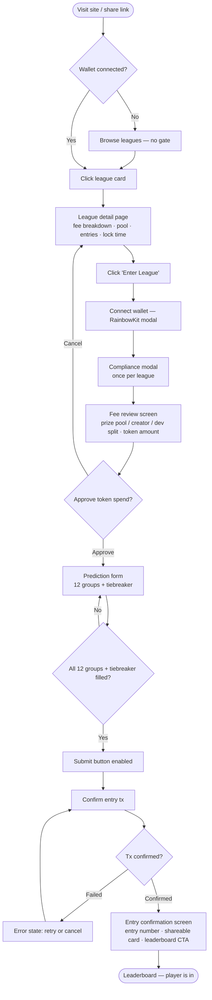
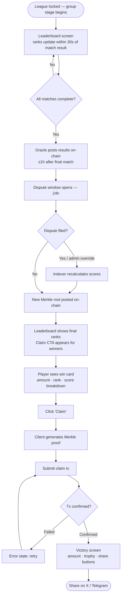
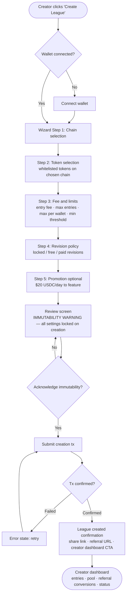
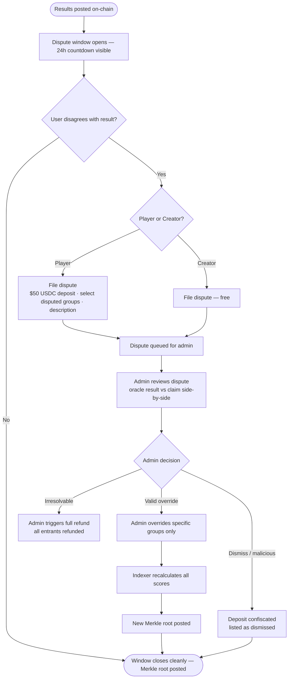
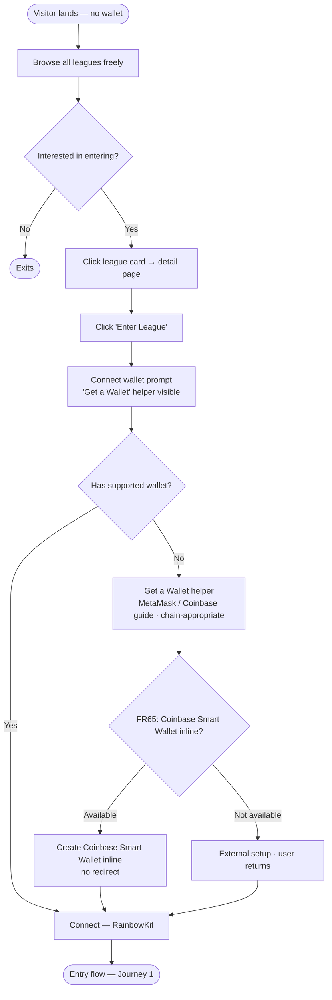

# UX Design Specification DegenDraft

**Author:** Stinky
**Date:** 2026-04-26

---

<!-- UX design content will be appended sequentially through collaborative workflow steps -->

## Executive Summary

### Project Vision

DegenDraft is a trustless, on-chain prediction league platform for World Cup 2026. Players pay an entry fee (any whitelisted ERC-20 token) to submit group stage predictions across all 12 groups, compete on a live leaderboard as matches resolve, and claim prizes via Merkle proof — no admin required to distribute winnings. Creators launch leagues for their communities (Discord, Telegram, friend groups) and earn a 3% fee. The platform runs on Base, Ethereum, and Sonic mainnet with a hard deadline of June 11, 2026.

### Target Users

**Player** — Crypto-native sports fan referred by a community (Discord, Telegram, X). Likely familiar with wallets and ERC-20 tokens. Primary device mix: desktop and mobile. Core desire: enter quickly, track rank as the World Cup unfolds, and claim winnings without friction.

**Creator** — Community organizer (Discord server or Telegram group admin, friend group coordinator). Moderate crypto literacy. Goal: configure a league for their group, share a referral link, monitor entries and prize pool, and ultimately collect their creator fee without running any infrastructure.

**Visitor** — Curious onlooker, possibly referred by a share link. May not have a wallet yet. Goal: assess whether the platform is trustworthy and worth joining; conversion path ends at wallet setup or league entry.

**Admin** — Internal platform operator. Manages oracle health, disputes, token whitelist, and global parameters. Workflow is desktop-only, function over form.

### Key Design Challenges

1. **Prediction form complexity** — Ranking 4 teams across 12 groups (A–L) + tiebreaker is the core product interaction. It must feel fast and game-like, not like filling a spreadsheet. Mobile is a first-class citizen: forced pagination (one group per screen) replaces drag-and-drop.

2. **Crypto friction at entry** — Players connect a wallet, approve a token spend, and submit an on-chain transaction to enter. Every unnecessary confirmation, unclear fee display, or confusing state transition risks abandonment. The fee breakdown (prize pool / creator fee / dev fee) must be visible and trusted before the user signs.

3. **Time-sensitive states** — The platform has four hard deadlines per league: lock time, results posting, dispute window close, and claim expiry. Each state requires different urgency treatment in the UI: countdown timers, status banners, action CTAs, and "missed" states for expired opportunities.

4. **Trust without custody** — Users stake real value but never see a traditional "account balance". Leaderboard rank, Merkle claim status, proof generation, and explorer links are the trust signals. These must be prominent and legible for non-expert users.

5. **Multi-wallet / multi-entry** — A player can submit multiple entries to the same league. The UI must clearly distinguish entries per wallet, track each entry's rank and payout independently, and handle wallet switching gracefully.

### Design Opportunities

1. **Leaderboard as the hero moment** — As matches resolve, rank changes are the emotional payoff. A live leaderboard with score breakdowns, animated rank shifts, and "you moved up X places" notifications could make the product genuinely exciting, not just functional.

2. **Creator-as-promoter flywheel** — The referral link + share card flow is a growth lever. If creator dashboards feel rewarding to check (pool growing, entries ticking up), creators become organic marketers.

3. **Claim flow as a feature, not plumbing** — Most users have never interacted with a Merkle claim. Framing it as "proving your win" rather than "submitting a proof" — with a clear success state — could be a memorable, shareable moment.

---

## Core User Experience

### Defining Experience

The prediction form is the make-or-break interaction. Everything before it (browse, connect, enter) is onboarding funnel; everything after it (leaderboard, dispute, claim) is payoff. Completing all 12 group rankings + tiebreaker and seeing a confirmation state is the moment a player is "in" — it must be fast, satisfying, and feel like a game action rather than form filling.

### Platform Strategy

Web application, responsive across desktop and mobile. No native app.

- **Desktop:** Mouse and keyboard primary. Drag-and-drop group ranking (@dnd-kit) is the flagship interaction. Full-page layouts with sidebar context panels (Polymarket odds, fee breakdown, progress indicator).
- **Mobile:** Touch primary. Forced pagination — one group per screen — with dropdown selectors per position (1st, 2nd, 3rd, 4th). Drag-and-drop not used on mobile. All core flows (browse, enter, leaderboard, claim) must work on a standard mobile browser without native app installation.
- **Admin panel:** Desktop-only. Function over form.

### Effortless Interactions

- **Wallet connection** — RainbowKit handles the connect flow; "Get a Wallet" helper shown when no wallet detected; chain switching re-verified silently in background.
- **Filling predictions** — Tab/click through groups with auto-advance on desktop; swipe pagination on mobile. Progress indicator always visible. No dead ends — incomplete submissions are blocked with clear messaging, not silent failures.
- **Leaderboard checking** — Near-realtime refresh (≤30s after match result indexed); rank changes immediately visible with score breakdown on tap/click.
- **Claiming a payout** — Single CTA when Merkle root is posted; proof generated client-side; one transaction to claim. No manual proof copying.

### Critical Success Moments

1. **Prediction submitted** — Player completes all 12 groups + tiebreaker and receives an on-chain confirmation. This is the first commitment moment; the confirmation state should feel like a ticket being issued, not a receipt.
2. **First rank change** — Player returns after a match resolves and sees their leaderboard position has changed. Score breakdown shows exactly why. This is when the product becomes real.
3. **Payout claimed** — The "prove your win" moment. Merkle claim succeeds; the UI celebrates it explicitly. This moment is shareable and defines whether winners tell others about the platform.

### Experience Principles

1. **Predictions feel like a game** — The form interaction is the product's personality. Fast, visual, responsive — closer to a fantasy sports app than a DeFi interface.
2. **Crypto complexity is hidden, not removed** — Wallet flows, token approvals, and Merkle proofs run in the background. Users see action + outcome, not mechanism. Technical detail is always one tap away for the curious, never forced on everyone.
3. **Time is always visible** — Every deadline (lock, results posting, dispute window, claim expiry) is surfaced at the relevant screen with appropriate urgency. No deadline is ever hidden or requires the user to calculate it.
4. **Trust is earned visually** — Fee breakdowns (prize pool / creator / dev split), on-chain explorer links, and smart contract addresses are always accessible. Skeptical users can verify everything without leaving the app.
5. **Every milestone is a moment** — Entry confirmation, first rank update, and payout claim each have distinct, satisfying completion states. No important user action ends with a spinner and nothing else.

---

## Desired Emotional Response

### Primary Emotional Goals

DegenDraft should feel like a **sports moment first, crypto platform second**. The World Cup is one of the most emotionally charged events in sport. The platform's UX should borrow that energy — competitive, communal, high-stakes — and let the crypto rails stay invisible to those who don't care about them.

**Primary emotional goal:** Players feel like active participants in the World Cup, not users of a financial product.

**Secondary feelings:** Confidence (I know what I'm paying and what I'm getting), investment (I have skin in the game), and pride (I called it right).

**Emotions to eliminate:** Confusion, scam suspicion, form fatigue, technical helplessness, and anticlimax.

### Emotional Journey Mapping

| Moment | Target Emotion | Anti-Pattern to Avoid |
|---|---|---|
| First visit / browse | Curious + legitimised — "this is a real platform with real money" | Confusion, scam suspicion |
| Wallet connect + entry fee review | Confident + informed — "I know exactly what I'm paying" | Anxiety, second-guessing |
| Filling predictions | Engaged + playful — game-like focus, bracket energy | Tedium, form fatigue |
| Prediction submitted | Thrilled + invested — "I'm in; I have skin in the game" | Flatness, transactional coldness |
| Watching leaderboard | Excited + competitive — fantasy sports app energy | Confusion about rank changes |
| Dispute window | Empowered + protected — "there's a fair process I can use" | Helplessness, platform distrust |
| Payout claimed | Victorious + proud — shareable, celebratory moment | Anticlimax, technical confusion |
| Error / something goes wrong | Informed + calm — knows what happened and what to do | Panic, abandonment |

### Micro-Emotions

- **Confidence over excitement** at the wallet and entry step — excitement comes after commitment is made, not during it. A user anxious about their transaction is a user who abandons.
- **Excitement over efficiency** on the leaderboard — "you moved up 3 places after Spain vs Germany" beats "rank: 4". The leaderboard is an emotional product, not a data table.
- **Pride over relief** at the claim step — framing the Merkle claim as "prove your win" rather than "complete withdrawal" turns a technical action into a victory lap.
- **Belonging over individualism** — leagues are social objects (Discord groups, friend circles). The UI should reinforce the community context: who else is in your league, how many entries, creator identity.

### Design Implications

- **Curiosity → legitimacy:** Landing page stats (TVL, active leagues, total players) are sourced live from the indexer — real numbers, not marketing copy. Smart contract addresses linked from footer.
- **Confidence → fee transparency:** Fee breakdown (prize pool / creator / dev %) shown before any transaction is signed. Never hidden behind a "+ fees" footnote.
- **Playfulness → prediction form pacing:** Progress bar always visible ("8 / 12 groups + tiebreaker ✓"). Auto-advance after completing each group on mobile. Satisfying micro-animations on group completion.
- **Investment → entry confirmation:** On-chain confirmation screen shows the player's entry number, their predicted standings, and a shareable card — not just a transaction hash.
- **Excitement → leaderboard design:** Rank change delta displayed prominently ("▲3"), not just absolute rank. Score breakdown expandable per group. Last updated timestamp always shown.
- **Empowerment → dispute UI:** Dispute filing flow shows oracle result vs. player's claim side by side. Deposit amount and refund condition stated plainly before signing.
- **Pride → claim screen:** Win amount highlighted, confetti or equivalent celebration, one-tap share to X/Twitter with the result.
- **Calm → error states:** Every error state explains what happened in plain English and offers the next action — never a raw error code or a dead end.

### Emotional Design Principles

1. **Sports energy, crypto rails** — The visual and interaction language comes from sports apps (ESPN, fantasy football), not DeFi dashboards. Crypto is the mechanism; the World Cup is the experience.
2. **Confidence before commitment** — All cost and risk information is fully surfaced before any wallet signature is requested. Users sign because they want to, not because they couldn't find the exit.
3. **Rank changes are the product** — The leaderboard is not a table; it is the ongoing emotional experience between entry and payout. Every design decision about the leaderboard is a decision about how exciting the platform feels.
4. **Wins deserve celebration** — Completing entry, moving up the leaderboard, and claiming a payout are each milestone moments. Each one gets a distinct, positive, shareable state.

---

## UX Pattern Analysis & Inspiration

### Inspiring Products Analysis

**ESPN Fantasy Sports / Sleeper**
The gold standard for live competitive leaderboards. Rank delta is the hero metric — "moved up 5" is more emotionally resonant than "rank: 4". Match-by-match score breakdowns give players a reason to return after every game. The pick/draft interface is fast and game-like, not form-like. Anti-pattern: ESPN's information density and ad-heavy layout creates cognitive overload — avoid.

**Polymarket**
Clean, data-forward UI built for crypto-native users. Trust signals (liquidity, number of traders) are prominent without being intimidating. Market card layout maps cleanly to league browse cards. Good mobile web experience without a native app. Anti-pattern: purely financial tone with no sports energy or personality — avoid the clinical DeFi aesthetic.

**Sorare**
Sports-first visual identity in a crypto context. Manager dashboard tells a story over time. Onboarding is guided and welcoming for crypto newcomers without dumbing down. Anti-pattern: NFT price speculation as primary UX driver — not relevant to DegenDraft's prediction model.

**RainbowKit / Uniswap**
Best-in-class wallet connection UX (already integrated via RainbowKit). Transaction confirmation flows are clear; fee display is honest and prominent. Anti-pattern: DeFi jargon (slippage, gas estimation as primary language) — translate everything to plain English for DegenDraft.

### Transferable UX Patterns

**Leaderboard patterns (from fantasy sports):**
- Rank delta displayed prominently alongside absolute rank (▲3, ▼1)
- Score breakdown expandable per match/group — users can drill into why their rank changed
- "Your pick vs. result" comparison view after results post
- Last updated timestamp always visible — sets expectation for refresh cadence

**Browse/discovery patterns (from Polymarket):**
- Card-based league grid with key stats (pool size, entry count, token, time to lock) scannable at a glance
- Filter rail (chain, token, fee range) persistent and fast — no full-page reload
- Featured row at top with visual distinction from standard listings

**Onboarding patterns (from Sorare):**
- Progressive disclosure — show the most important thing first, reveal complexity on demand
- "Get started" path for wallet-less visitors that doesn't dead-end
- Guided first entry with inline explanations at each step

**Transaction patterns (from Uniswap/RainbowKit):**
- Fee breakdown always shown before signing — never buried
- Transaction pending / confirmed / failed states are distinct and clear
- Explorer link available on confirmed state for the curious, not forced on everyone

### Anti-Patterns to Avoid

- **Buried fee disclosure** — "0.5% fee" in a footnote after a prominent "Win big!" CTA; always show the full breakdown upfront
- **Wallet-first gates** — forcing wallet connection before any browsing; visitors can browse all leagues without connecting
- **Raw transaction hashes as success states** — "Tx: 0xabc123..." is a receipt, not a confirmation; wrap it in a meaningful success state
- **Infinite scroll on the prediction form** — all 12 groups on one page with no progress indication creates form fatigue; use pagination + progress bar
- **Silent failures** — transaction failed → blank state with no explanation; every error state must explain what happened and offer a next action
- **DeFi jargon as primary language** — "submit Merkle proof" → "claim your prize"; "oracle post" → "results confirmed"
- **Static leaderboard** — rank displayed without context (no delta, no score breakdown, no last-updated) feels broken after match results post

### Design Inspiration Strategy

**Adopt directly:**
- Fantasy sports rank delta + score breakdown leaderboard pattern
- Polymarket card grid for league browse
- RainbowKit wallet connection (already decided in architecture)
- Uniswap-style pre-signature fee breakdown display

**Adapt for DegenDraft:**
- Sorare onboarding guidance → simplify for prediction context (no NFT/card mechanics to explain)
- Polymarket market card → league card (replace probability % with pool size, entry count, time to lock)
- Fantasy sports draft interface pacing → prediction form (one group at a time on mobile; DnD grid on desktop)

**Avoid entirely:**
- ESPN information density and ad-layer navigation
- DeFi-first visual language and terminology
- NFT speculation mechanics or price-as-primary-signal UI

---

## Design System

### Approach

**Tailwind CSS + shadcn/ui** (Radix UI primitives, copy-paste component model)

Tailwind CSS is already committed in the architecture. shadcn/ui is the chosen component library layer.

### Rationale

- **No runtime dependency / full ownership** — shadcn/ui components are copied into the codebase at `frontend/src/components/ui/`. No version lock-in; components are edited directly when customisation is needed.
- **Accessibility built-in** — Radix UI primitives provide WCAG 2.1 AA keyboard navigation and ARIA roles out of the box, fulfilling NFR20 without additional work.
- **Tailwind-native** — Zero friction with the existing stack; no CSS-in-JS or conflicting style systems.
- **Timeline-appropriate** — Fast to initialise, customise incrementally. Mature community with excellent documentation.
- **Stack compatibility** — @dnd-kit (prediction form drag-and-drop), @tanstack/react-query (data fetching), zustand (state), and wagmi/viem (wallet) all integrate cleanly alongside shadcn/ui components.

### Component Strategy

**Use shadcn/ui for:**
- All base UI primitives: Button, Input, Select, Dialog, Sheet, Tabs, Card, Badge, Tooltip, Popover, DropdownMenu, Toast/Sonner
- Form components: Form (react-hook-form integration), Checkbox, RadioGroup
- Layout: Skeleton (loading states), Separator, ScrollArea

**Build custom on top of shadcn/ui for:**
- `<PredictionForm>` — DnD desktop / paginated-dropdown mobile composition
- `<LeaderboardTable>` — rank delta display, score breakdown expandable rows
- `<LeagueCard>` — browse grid card with pool stats, token badge, countdown
- `<MerkleClaimPanel>` — claim status, proof generation, victory state
- `<OracleHealthCard>` — per-chain status indicator (admin)
- `<FeeBreakdownTooltip>` — prize pool / creator / dev split display
- `<WalletConnectGate>` — RainbowKit wrapper with "Get a Wallet" fallback

**Third-party components retained from architecture:**
- `@dnd-kit/core` + `@dnd-kit/sortable` — prediction form drag-and-drop (desktop only)
- RainbowKit `<ConnectButton>` — wallet connection
- `@tanstack/react-query` — all async data fetching and caching

### Design Tokens

Customise Tailwind config (`tailwind.config.ts`) with project-specific tokens:
- **Colors:** Primary (action/CTA), surface (card backgrounds), border, muted, destructive (errors), success, warning — mapped to CSS variables for dark/light mode support
- **Typography:** Single sans-serif font stack (Inter or equivalent); scale from `xs` to `4xl`; monospace for wallet addresses and tx hashes
- **Spacing:** Standard Tailwind scale; no custom values unless required by a specific component
- **Border radius:** Consistent card/button radius via `--radius` CSS variable (shadcn/ui convention)

---

## Defining Core Experience

### Defining Experience

*"Build your World Cup bracket and bet on it."*

The defining interaction is prediction form submission — ranking all 12 World Cup groups and committing those predictions on-chain. Everything before it (browse, connect, enter) is onboarding; everything after it (leaderboard, dispute, claim) is payoff. If this interaction feels fast, game-like, and trustworthy, the rest of the product succeeds.

### User Mental Model

Players arrive with an existing mental model from fantasy football, office pools, and World Cup sweepstakes. They understand ranking teams within groups. They do not understand commitment hashes or on-chain entry — and they should not need to. The UI bridges the gap with plain language: *"Your predictions are locked on-chain — no one can see or change them until the league locks."*

The only genuinely novel behaviour is the on-chain entry transaction (ERC-20 approval + contract call). This is handled by positioning it as a single "confirm entry" action with a clear fee summary, not as two separate cryptographic operations.

### Success Criteria

- Median time to complete prediction form ≤ 4 minutes on desktop, ≤ 6 minutes on mobile
- Zero submissions possible without all 12 groups + tiebreaker filled — enforced by UI, not just validation
- Player knows exactly what they paid and why before signing any transaction
- Confirmation screen delivers a shareable artefact (entry card) immediately on tx confirmed
- Every error state during entry offers a clear next action — no dead ends

### Interaction Pattern: Desktop

**Initiation**
Player clicks "Enter League" on league detail page. Compliance modal shown (once per league). Fee breakdown displayed (prize pool / creator / dev split, exact token amount). "Confirm & Start Predictions" CTA unlocks the form.

**Interaction**
12 groups displayed in a 2-column × 6-row grid. Each group is a drag-and-drop sortable list (@dnd-kit). Player drags teams into 1st / 2nd / 3rd / 4th positions. Completed groups are visually marked with a ✓. Polymarket odds panel sits alongside each group as a passive reference (collapsed by default, expandable). Tiebreaker input (total goals, 1–1000) appears after all 12 groups are completed.

**Feedback**
Progress indicator updates live: "8 / 12 groups + tiebreaker ✓". Completed groups show a ✓ badge. Submit button remains disabled until 12/12 + tiebreaker filled. Incomplete submission attempt highlights unfilled groups — no silent failures.

**Completion**
On-chain entry transaction submitted. Pending state shown with spinner + "Locking your predictions on-chain...". Confirmed state shows: entry number, predicted standings summary, shareable entry card, and CTA to league leaderboard.

### Interaction Pattern: Mobile

**Initiation**
Same compliance modal and fee review. "Start Predictions" CTA.

**Interaction**
Forced pagination — one group per screen. Each screen shows group name, 4 team position dropdowns (1st, 2nd, 3rd, 4th). "Next Group →" button enabled only when all 4 positions are filled. Sticky progress bar at top: "Group 3 of 12". Back navigation always available without losing progress. Tiebreaker input on the final screen after Group 12.

**Feedback**
Cannot advance without completing current group — button disabled, not hidden. Back navigation preserves selections. Tiebreaker screen shows a summary of all 12 groups before the submit CTA.

**Completion**
Identical confirmed state to desktop — entry number, summary, shareable card, leaderboard CTA.

### Novel UX Patterns

The DnD-based group ranking form is novel relative to most crypto apps but familiar from fantasy draft and bracket tools. No user education is required for the drag mechanic itself — it maps directly to existing mental models. The only education needed is the on-chain commitment step, handled via inline copy at the fee review screen.

---

## Visual Design Foundation

### Color System

**Direction: Dark-primary, high-contrast — football stadium at night**

The World Cup is a prime-time event. A dark UI reinforces that energy, makes country flags and team colours pop, and matches the expectations of crypto-native users. Country flags on prediction and leaderboard screens provide all the colour variety needed — the UI palette stays controlled.

| Token | Value | Use |
|---|---|---|
| `background` | `#0A0E1A` | Page background (deep navy-black) |
| `surface` | `#131929` | Card and panel layer |
| `surface-elevated` | `#1C2438` | Modals, dropdowns, hover states |
| `border` | `#2A3450` | Card borders, dividers |
| `primary` | `#3B82F6` / `#60A5FA` (hover) | CTAs, links, interactive elements |
| `success` | `#22C55E` | Confirmed tx, correct prediction, claimed |
| `warning` | `#F59E0B` | Dispute window open, approaching deadline |
| `destructive` | `#EF4444` | Oracle failure, error, frozen state risk |
| `muted` | `#6B7280` | Secondary labels, timestamps |
| `foreground` | `#F1F5F9` | Primary text |

All tokens are mapped to CSS variables following the shadcn/ui convention, enabling consistent theming across components.

### Typography System

**Primary font: Inter** (Google Fonts / Bunny Fonts — zero licence cost)
**Monospace font: JetBrains Mono** — wallet addresses, transaction hashes, contract addresses

| Scale | Size | Weight | Use |
|---|---|---|---|
| `display` | 36px / 2.25rem | 700 | Hero headings, landing page |
| `h1` | 28px / 1.75rem | 700 | Page titles |
| `h2` | 22px / 1.375rem | 600 | Section headers |
| `h3` | 18px / 1.125rem | 600 | Card titles, league names |
| `body` | 15px / 0.9375rem | 400 | Default reading text |
| `small` | 13px / 0.8125rem | 400 | Labels, timestamps, badges |
| `mono` | 13px / 0.8125rem | 400 | Addresses, hashes, amounts |

### Spacing & Layout Foundation

- **Base unit:** 4px (standard Tailwind scale — no custom spacing values)
- **Content max-width:** 1280px, centered, 24px horizontal padding on desktop → 16px on mobile
- **Card grid:** 3-column on desktop (`lg`), 2-column on tablet (`md`), 1-column on mobile
- **Overall density:** Comfortable breathing room — closer to Polymarket than Binance; no information cramming
- **Z-axis layers:** background → surface → surface-elevated → overlay (modal/sheet)

### Accessibility Considerations

- **Contrast targets:** All text/background combinations ≥ 4.5:1 (WCAG AA). `foreground` `#F1F5F9` on `surface` `#131929` ≈ 13:1 ✓; `primary` `#60A5FA` on dark background ≈ 7:1 ✓
- **Focus rings:** Visible 2px primary-colour outline on all interactive elements (shadcn/ui default, not overridden)
- **Colour + icon:** Colour is never the sole indicator of state. All status colours (success, warning, destructive) are accompanied by an icon and a text label
- **Font size floor:** 13px minimum for all rendered text; no sub-12px labels anywhere in the UI
- **Touch targets:** All interactive elements ≥ 44 × 44px on mobile (WCAG 2.5.5)

---

## Design Direction Decision

### Design Directions Explored

Four directions were generated and reviewed as interactive HTML mockups (`ux-design-directions.html`):

1. **Broadcast** — Top-nav, hero stats bar, editorial card grid. Sports-broadcast editorial hierarchy.
2. **Arena** — Persistent sidebar nav, dashboard-first, metric-heavy leaderboard layout.
3. **Field** — Prediction form as full-page hero, sticky progress bar, game-first minimal chrome.
4. **Victory** — Claim payout screen; win card, score breakdown, single CTA.

### Chosen Direction

**Direction 1 — Broadcast**

Top-navigation shell with editorial information hierarchy. Hero stats section on the landing/browse page (TVL, active leagues, total players). Card grid for league browse below. Clear primary nav: Browse / My Leagues / Create / Leaderboard.

### Design Rationale

- **Broadcast hierarchy** matches how sports fans consume information — headline stats first, drill-down on demand. This is a sports product before it is a DeFi product.
- **Top navigation** is the universal web pattern; it maximises usable vertical space for content (league cards, leaderboard, prediction form) versus a sidebar that would waste horizontal space on the most important screens.
- **Hero stats bar** (TVL, active leagues, total players) provides immediate trust signals on first visit — live numbers sourced from the indexer, not static marketing copy.
- **Card grid** maps cleanly to Polymarket's proven browse pattern; filter rail above, featured row at top, standard grid below.
- The Broadcast shell works across all screens: browse uses the card grid, the prediction form uses the full content area (Direction 3 mechanics inside the Broadcast shell), leaderboard uses a two-column layout (Direction 2 leaderboard inside the Broadcast shell).

### Implementation Approach

- **Shell component:** `<AppShell>` — top `<NavBar>` + `<main>` content area. No sidebar.
- **NavBar:** Logo | Browse | My Leagues | Create | [right: chain badge + wallet address]
- **Landing/Browse page:** `<HeroStats>` banner (TVL, active leagues, players) + filter rail + `<LeagueGrid>` (featured row + standard grid)
- **Prediction form:** Full-width content area, 2-column group grid on desktop, paginated on mobile — Direction 3 mechanics inside the Broadcast shell
- **Leaderboard page:** Two-column layout: main leaderboard table (left) + league info + score breakdown panel (right) — Direction 2 mechanics inside the Broadcast shell
- **Claim page:** Centred single-column layout (max-width 640px) — Direction 4 mechanics inside the Broadcast shell

---

## User Journey Flows

### Journey 1: Player Entry (Core Loop)

Entry point: share link, browse, or direct URL. Gate: wallet connection deferred until "Enter League" is clicked — browsing is always free.

### Journey 2: Player Leaderboard & Claim

Continuation after entry. Leaderboard refreshes within 30s of indexed match result. Claim CTA only appears after Merkle root is posted.

### Journey 3: Creator — Launch League

Multi-step wizard with immutability acknowledgment gate before creation tx.

### Journey 4: Dispute Flow

Triggered within 24h of results posting. Admin is the final arbiter — no on-chain governance.

### Journey 5: Visitor Conversion (No Wallet)

No hard gate on browsing. Wallet prompt deferred to entry intent. "Get a Wallet" helper is chain-appropriate.

### Journey Patterns

**Wallet gate pattern** — Connection deferred to first action requiring it (Enter League, Create League). Browsing, league detail, and stats are always public. Applied consistently across all flows.

**Tx confirmation pattern** — All on-chain actions follow: pending spinner → confirmed success state → next CTA. Failed tx shows error with retry option, never a dead end.

**Wizard with acknowledgment gate** — Multi-step forms (league creation, dispute filing) use a review screen with explicit acknowledgment before the tx. Prevents accidental irreversible actions.

**Progressive disclosure** — Fee breakdowns, smart contract links, and Merkle proof details are always one tap away but never forced on primary CTAs.

### Flow Optimization Principles

- **Minimize steps to the prediction form** — The compliance modal and fee review are single screens, not multi-page flows. Entry tx follows immediately after form completion.
- **No silent failures** — Every error state explains what happened and offers a concrete next action (retry, cancel, contact support).
- **Shareable artefact at every milestone** — Entry confirmation, win notification, and claim success each produce a shareable card. Virality is baked into the success states.
- **Countdown always visible** — Lock time, dispute window, and claim expiry are shown as countdown timers on every relevant screen, not buried in league info.

---

## Component Strategy

### Foundation Components (shadcn/ui — no custom work needed)

Button, Input, Select, Dialog, Sheet, Tabs, Card, Badge, Tooltip, Popover, DropdownMenu, Sonner (toast), Form + react-hook-form, Checkbox, RadioGroup, Skeleton, Separator, ScrollArea

### Custom Components

**`<AppShell>`**
Top navbar + content area wrapper. NavBar: logo | Browse | My Leagues | Create | [right: chain badge + wallet connect]. Sticky with blurred background on scroll. No sidebar. Responsive: hamburger menu on mobile collapses nav links into a Sheet.

**`<HeroStats>`**
Full-width banner below nav on browse/landing page. Displays TVL, active leagues, total players — live data from indexer. Loading state: Skeleton. Stale state: dimmed with last-updated timestamp.

**`<LeagueCard>`**
Browse grid card. States: `open`, `locked`, `resolving`, `resolved`, `refunded`. Anatomy: league name + creator + chain badge (top) / entry token + fee + lock countdown (middle) / pool size + entries progress bar + entry count (bottom) / Enter CTA. Featured variant: warning-colour border + star badge. Hover: primary border highlight.

**`<FeeBreakdown>`**
Inline fee table shown on league detail and prediction form footer. Rows: entry fee / prize pool / creator fee % / dev fee % / total. Always visible before any transaction — never behind a tooltip-only pattern.

**`<PredictionForm>`**
Desktop: 2-column × 6-row group grid with `@dnd-kit` sortable lists per group. Mobile: forced pagination, one group per screen with 4 position dropdowns. Shared state: tracks completion per group, enables submit only when 12/12 + tiebreaker filled. Prop: `revisionPolicy` controls whether existing entry data is pre-filled.

**`<PredictionGroupCard>`**
Single group within the prediction form. Anatomy: group header + done icon (top) / 4 DnD team rows with position badge + flag emoji + team name + Polymarket odds % on desktop / 4 dropdown rows on mobile. States: `unstarted` (muted), `in-progress` (primary border + active shadow), `complete` (success border + ✓).

**`<PolymarketOddsWidget>`**
Passive reference panel alongside prediction form. Shows win probability % per team in the active group, data-as-of timestamp, and staleness warning if >24h old. Hides gracefully (collapsed) on API failure — prediction form remains fully functional without it.

**`<PredictionProgressBar>`**
Sticky element on prediction form — inside nav bar on desktop, top strip on mobile. Shows "X / 12 groups + tiebreaker ✓". Updates live on each group completion. Never hidden during the form.

**`<ComplianceModal>`**
Dialog. Shown once per league entry (tracked by wallet address + league ID, not by session). User must check a jurisdiction self-certification checkbox and click confirm before the prediction form is accessible. Cannot be dismissed without explicit confirmation.

**`<LeaderboardTable>`**
Main leaderboard display. Columns: rank / player (ENS/Basename/truncated address + avatar) / score / rank delta (▲N / ▼N / —). Current user row highlighted in primary blue. Expandable rows: score breakdown per group on click/tap. `lastUpdatedAt` timestamp shown above table. Data driven by indexer — no polling, event-triggered.

**`<ScoreBreakdown>`**
Expandable panel (inside LeaderboardTable row or as side panel). Per-group score, perfect group bonus indicator, tiebreaker value. Summary total at bottom.

**`<CountdownTimer>`**
Reusable countdown display. Variants: `lock` (warning colour, "Locks in Xd Yh"), `dispute` (warning, "Dispute window closes in Xh"), `claim-expiry` (danger, "Claim expires in X days"). Tabular-nums font. Never hidden when deadline is active on a relevant screen.

**`<WalletConnectGate>`**
Wraps RainbowKit `<ConnectButton>`. When no wallet detected: shows "Connect Wallet" CTA + "Get a Wallet" helper link (chain-appropriate: MetaMask/Coinbase for EVM). Chain mismatch: shows "Switch to [chain]" prompt. Admin route variant: additionally verifies against Postgres admin whitelist after connect and re-verifies on chain switch.

**`<TxStatusBanner>`**
In-page persistent status strip for pending/confirmed/failed on-chain transactions. States: `pending` (spinner + "Confirming on [chain]…"), `confirmed` (success icon + explorer link), `failed` (error icon + retry CTA). Persistent until dismissed or resolved — not a transient toast.

**`<EntryConfirmation>`**
Full-screen post-entry success state. Shows: entry number, predicted standings summary, shareable OG entry card image, "View Leaderboard" CTA. Feels like a ticket being issued, not a transaction receipt.

**`<ClaimPanel>`**
Claim payout screen. Anatomy: win card (trophy + amount + rank + rank delta from start) / score breakdown / fee breakdown (prize pool / creator / dev split, contract address) / claim CTA / share row (X, Telegram, copy card). States: `claimable` (active CTA), `pending` (tx in flight), `claimed` (victory celebration state), `expired` (claim window elapsed — informational).

**`<OracleHealthCard>`**
Admin only. Per-chain status: green (results posted on time) / red (overdue). Shows last posted time, expected deadline, manual post form pre-filled from api-football.com, grace extension button. One card per deployed chain (Base, Ethereum, Sonic).

**`<DisputePanel>`**
Admin dispute review card. Shows oracle result vs. disputant's claim side-by-side per disputed group. Actions: approve override (specific groups only) / dismiss + confiscate deposit / trigger full refund. Deposit amount and refund condition stated plainly in plain English.

**`<CreatorDashboard>`**
Creator's league monitoring view. Metrics: entry count, pool value, referral conversion count, league status badge. Referral link with one-click copy for Discord / Telegram / X. Edit-predictions CTA visible if revision policy allows.

**`<TokenWhitelistQueue>`**
Public queue of pending whitelist requests. Each card: token address + chain + upvote/downvote count + fee-on-transfer/rebase auto-detection flag. Admin variant adds approve/reject action buttons.

**Admin validation — pre-submission guards (must be checked before enabling the Approve button):**
- **Zero address check:** If the submitted token address is `0x000...000`, show a red inline error badge "Invalid address — cannot be zero address" and disable the Approve button. The `WhitelistRegistry` contract will revert with `InvalidTokenAddress` if this reaches the chain.
- **EOA check:** Resolve the token address on-chain (`eth_getCode`). If the address has no deployed bytecode (it is a wallet, not a contract), show a red inline error badge "Address is a wallet, not a token contract" and disable the Approve button. The `WhitelistRegistry` contract enforces `token.code.length > 0` and will revert with `InvalidTokenAddress`.
- Both checks must run automatically when the admin opens a request card. The Approve button stays disabled until both pass. This prevents wasted gas on transactions that will revert.

### Implementation Priority

| Phase | Components | Drives |
|---|---|---|
| **P1 — Core** | AppShell, WalletConnectGate, LeagueCard, PredictionForm, PredictionGroupCard, PredictionProgressBar, ComplianceModal, FeeBreakdown, TxStatusBanner, EntryConfirmation | Entry flow (Journey 1) |
| **P2 — Post-entry** | LeaderboardTable, ScoreBreakdown, CountdownTimer, ClaimPanel | Leaderboard + claim (Journey 2) |
| **P3 — Creator** | CreatorDashboard, HeroStats, PolymarketOddsWidget | Creator flow (Journey 3) |
| **P4 — Admin** | OracleHealthCard, DisputePanel, TokenWhitelistQueue | Admin flows |

---

## UX Consistency Patterns

### Button Hierarchy

**Primary** — One per view. Full-colour primary blue. Used for the single most important or irreversible action on a screen (Submit Entry, Claim Prize, Create League, Confirm Override). Label format: action verb + object + amount where relevant ("Submit Entry — 50 USDC", "Claim 2,208.75 USDC").

**Secondary / Outline** — Supporting actions with no fill (Share, Edit, View Leaderboard, Cancel). Used when a second action is needed alongside primary.

**Destructive** — Red variant for irreversible destructive admin actions only (Trigger Full Refund, Confiscate Deposit). Never used in player-facing flows.

**Disabled** — Shown disabled, never hidden, when preconditions aren't met (form incomplete, compliance not acknowledged). Always accompanied by an explanatory label below or inline ("4 groups remaining to complete submission").

**Loading** — Primary button enters loading state (spinner + "Confirming…") during tx submission. Never removed from DOM — prevents duplicate transaction submissions.

### Feedback Patterns

**Transaction status** — `<TxStatusBanner>` for all on-chain actions. Inline, persistent strip — not a toast. Pending → confirmed → failed. Explorer link always available on confirmed state.

**Milestone success states** — Full-screen or full-panel for entry confirmation and claim success (these are shareable moments, not toasts). Sonner toast for minor confirmations only (link copied, revision saved).

**Error states** — Plain-English explanation + next action. Format: "[What went wrong] — [What to do]". Never raw error codes, HTTP status numbers, or empty blank panels.

**Warning states** — Warning colour for time pressure (lock approaching, dispute window open, claim expiring). Always paired with a countdown or explicit deadline date — never colour-only.

**Empty states** — Every empty state has a message and a recovery CTA. No blank boxes. Examples: empty league grid → "No leagues match your filters" + clear-filters CTA; empty My Leagues → "You haven't entered any leagues yet" + Browse CTA; pre-lock leaderboard → "Leaderboard updates when the league locks and matches begin".

### Form Patterns

**Validation** — Inline, triggered on blur (not on submit). Error message appears directly below the offending field in danger colour with an icon. Never a summary list at the top only.

**Progress indication** — All multi-step forms (prediction form, creation wizard) show a persistent progress indicator. Users always know which step they're on and how many remain.

**Structured selects** — Token and chain selects use searchable dropdown (shadcn Select + cmdk). Never free-text input for structured choices.

**Irreversibility gate** — Any action that cannot be undone requires: explicit acknowledgment checkbox + confirm button + copy stating the specific irreversible consequence. Applied to: league creation review, dispute filing, admin override actions.

**Mobile forms** — Single-column layout. Full-width inputs. 44px minimum touch targets. No side-by-side fields on screens < 640px wide.

### Navigation Patterns

**Top nav** — Logo (links home) | Browse | My Leagues | Create | [right aligned: chain badge + ConnectButton]. Active page: font-weight 700 + 2px primary bottom border.

**Breadcrumb** — Used on league detail and prediction form screens: "Browse / League Name / Predict". Each segment tappable.

**Back navigation** — Prediction form pagination: explicit "← Back" always visible. Never rely on browser back. Progress preserved on back navigation.

**Deep links** — Every league has a stable shareable URL (`/leagues/[chainId]/[address]`). Filter state is not persisted in URL for MVP.

### Modal & Overlay Patterns

**Dialog (blocking)** — Compliance modal, immutability acknowledgment, wallet connection. Cannot be dismissed by clicking outside when explicit acknowledgment is required. Always includes an explicit cancel when safe dismissal is possible.

**Sheet (drawer)** — Mobile nav menu only. Slides in from the right.

**Tooltip** — Supplementary info only (e.g. "What is a tiebreaker?", "What is the dispute window?"). Never the sole location of required information.

### Loading States

**Skeleton screens** — League grid, leaderboard, stats. Never a full-page spinner for content-heavy pages. Skeletons match the shape of the loading content.

**Inline spinners** — Inside buttons during tx submission. Inside `<TxStatusBanner>` pending state.

**Optimistic updates** — Not used for on-chain state — wait for tx confirmation before updating UI. Off-chain state (leaderboard rank) can be updated on indexer event receipt without waiting for user interaction.

### Language & Copy Patterns

| Technical term | Player-facing copy |
|---|---|
| Submit Merkle proof | Claim your prize |
| Oracle posts results | Results confirmed on-chain |
| Commitment hash | Your predictions are locked |
| ERC-20 approval | Allow [token] to be spent |
| Dispute window | Challenge period |
| tx hash | View on explorer |
| Wallet address | Your wallet |
| League state: Resolved | League complete |
| League state: Refunded | League cancelled — refunded |

Admin panel retains technical language (oracle, Merkle root, dispute deposit) where appropriate for operator context.

---

## Responsive Design & Accessibility

### Responsive Strategy

**Approach: Mobile-first CSS, desktop-enhanced.**

All layout logic written mobile-first. Desktop features (DnD, multi-column, side panels) are enhancements added at larger breakpoints — never fallbacks.

| Breakpoint | Width | Layout Behaviour |
|---|---|---|
| `default` | 0–639px | Single column, paginated prediction form, hamburger nav |
| `sm` | 640px+ | Wider cards, 2-column grid possible |
| `md` | 768px+ | 2-column league grid, side panels on detail screens |
| `lg` | 1024px+ | 3-column league grid, DnD prediction form, full persistent nav |
| `xl` | 1280px | Content max-width cap — centred with 24px padding |

### Desktop Enhancements (`lg`+)

- Drag-and-drop prediction form (2-column × 6-row group grid with @dnd-kit)
- Two-column leaderboard + side panel layout
- Polymarket odds panel visible alongside prediction group cards
- Three-column league browse grid
- Persistent full top nav (no hamburger)

### Mobile Adaptations (default – `md`)

- Prediction form: forced pagination, one group per screen, 4 position dropdowns per group
- League grid: single column
- Nav: hamburger icon → Sheet drawer (slides from right)
- Leaderboard: stacked single-column; score breakdown opens as bottom Sheet
- All primary CTAs full-width
- Prediction form DnD **not used** on touch — dropdown selectors only

### Tablet (768–1023px)

- Prediction form uses mobile/paginated mode (DnD not reliable on touch devices)
- League grid: 2-column
- Nav: hamburger or abbreviated top nav

### Accessibility Requirements

**Compliance target: WCAG 2.1 AA** (NFR20)

**Colour contrast**
- All normal text (≤18px regular / ≤14px bold) ≥ 4.5:1 against background
- Large text (≥24px regular / ≥18.67px bold) ≥ 3:1
- UI component boundaries (inputs, buttons, focus rings) ≥ 3:1

**Keyboard navigation**
- All interactive elements reachable via `Tab` / `Shift+Tab`
- DnD prediction form: keyboard alternative via arrow keys (dnd-kit native support)
- Modal/Dialog: focus trapped while open; returned to trigger element on close
- Skip link: "Skip to main content" as first focusable element on every page

**Screen reader support**
- Semantic HTML: `<nav>`, `<main>`, `<section>`, `<article>`, `<header>` used correctly
- Icon-only buttons carry `aria-label`
- Leaderboard: `<table>` with `<caption>`, `<th scope="col">`, proper `<td>`
- Dynamic regions (leaderboard, TxStatusBanner, HeroStats): `aria-live="polite"`
- Countdown timers: `aria-live` updated at meaningful intervals (not every second tick)

**Touch targets**
- All interactive elements ≥ 44×44px on mobile (WCAG 2.5.5)
- Prediction form dropdown rows: minimum 48px height

**Motion**
- All transition animations and celebration effects respect `prefers-reduced-motion: reduce`
- Rank change delta animations, entry confirmation confetti: disabled when preference set

**Colour independence**
- All state indicators (success, warning, error) use icon + label in addition to colour
- Leaderboard rank delta: ▲/▼ symbol is the primary indicator; colour is secondary reinforcement

### Developer Testing Checklist

**Responsive**
- [ ] Chrome + Safari on iPhone SE (375px) and iPhone 14 Pro (390px)
- [ ] Chrome on Android (360px)
- [ ] iPad (768px) — prediction form must use paginated/dropdown mode
- [ ] 1280px desktop — full DnD form, 3-col grid, side panels

**Accessibility**
- [ ] Keyboard-only full entry flow: connect → compliance modal → prediction form → submit
- [ ] VoiceOver (macOS/iOS): leaderboard table and prediction form
- [ ] axe DevTools automated scan on all key pages — zero critical findings
- [ ] Contrast checker on all text/background colour combinations
- [ ] `prefers-reduced-motion` test — verify all animations suppressed
